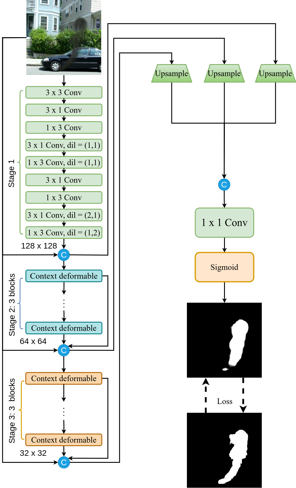

# Speed smoke segmentation

<!-- Implementation of paper - [YOLOv9: Learning What You Want to Learn Using Programmable Gradient Information](https://arxiv.org/abs/2402.13616) -->

<div align="center">
    <a href="./">
        
    </a>
</div>


## Performance 

SYN70K ( $256 \times 256$ )

| Model | Size | Param. | FLOPs | DS01 | DS02 | DS03 |
| :-: | :-: | :-: | :-: | :-: | :-: | :-: |
| **My** | **1.35MB** | **0.353M** | **0.873G** | **72.23%** | **71.95%** | **72.95%** |

## Installation

Docker environment (recommended)
<details><summary> <b>Expand</b> </summary>

``` shell
# create the docker container, you can change the share memory size if you have more.
nvidia-docker run --name yolov9 -it -v your_coco_path/:/coco/ -v your_code_path/:/yolov9 --shm-size=64g nvcr.io/nvidia/pytorch:21.11-py3

# apt install required packages
apt update
apt install -y zip htop screen libgl1-mesa-glx

# pip install required packages
pip install seaborn thop

# go to code folder
cd /yolov9
```

</details>


## Evaluation

[`best.pt`](https://github.com/WongKinYiu/yolov9/releases/download/v0.1/yolov9-c-converted.pt)

``` shell
# evaluate smoke segmentation models
python val.py -ti /home/yaocong/Experimental/Dataset/SYN70K_dataset/testing_data/DS03/images/ -tm /home/yaocong/Experimental/Dataset/SYN70K_dataset/testing_data/DS03/masks/ -m /home/yaocong/Experimental/speed_smoke_segmentation/trained_models/best.pth

```


You will get the results:

```
model_name: <module 'models.CGNet_2_erfnet31_13_3113_oneloss_inv_attention' from '/home/yaocong/Experimental/speed_smoke_segmentation/models/CGNet_2_erfnet31_13_3113_oneloss_inv_attention.py'>
Testing on device cuda.
model size:                     1.347 MB
Computational complexity(FLOPs):   873.04 MMac
Number of parameters:           353.07 k
model path: /home/yaocong/Experimental/speed_smoke_segmentation/trained_models/best.pth
test_data: /home/yaocong/Experimental/Dataset/SYN70K_dataset/testing_data/DS03/images/
Number of test Images: 1000
100%|████████████████████████████████████████████████████████████████████████████████████| 1000/1000 [00:25<00:00, 39.63it/s, test_hd=12.6, test_loss=0.35, test_mSSIM=81.6, test_miou=72]
FPS:39.6
totally cost: 0m 25s
loss: 0.3498
mIoU: 72.00%
```


## Training

<!-- Data preparation -->

``` shell
python main.py -bs 32 -train_dataset Host_SYN70K -e 500 -wn base_use_ConvINReLU_downsample
```

| Parameter | Description | Default Value |
| --- | --- | --- |
| -train_dataset<br>--train_dataset_path | use dataset path | Host_SYN70K |
| -validation_dataset<br>--validation_dataset_path | use test dataset path | Host_DS0123 |
| -ti<br>--train_images | path to hazy training images | |
| -tm<br>--train_masks | path to mask | |
| -vi<br>--validation_images | path to hazy training images | |
| -vm<br>--validation_masks | path to mask | |
| -bs<br>--batch_size | set batch_size | 8 |
| -nw<br>--num_workers | set num_workers | 1 |
| -e<br>--epochs | number of epochs for training | 150 |
| -lr<br>--learning_rate | learning rate for training | 0.001 |
| -wd<br>--weight_decay | weight decay for training | 0.00001 |
| -savedir<br>--model_save_dir | directory to save the model snapshot | ./trained_models/ |
| -device | running on CPU or GPU | GPU |
| -gpus | defualt GPU devices(0,1) | 0 |
| -resume | use this file to load last checkpoint for continuing training | |

Single GPU training

``` shell
# train yolov9 models

```

Multiple GPU training

``` shell
# train yolov9 models


```

## Inference

<div align="center">
    <a href="./">
        
    </a>
</div>

``` shell
# inference smoke segmentation models
python inference_multiple_pictures_for_evaluate.py -td /home/yaocong/Experimental/Dataset/SYN70K_dataset/testing_data/DS01/ -m /home/yaocong/Experimental/speed_smoke_segmentation/trained_models/best.pth

```


## Citation

<!-- ```
@article{wang2024yolov9,
  title={{YOLOv9}: Learning What You Want to Learn Using Programmable Gradient Information},
  author={Wang, Chien-Yao  and Liao, Hong-Yuan Mark},
  booktitle={arXiv preprint arXiv:2402.13616},
  year={2024}
}
```

```
@article{chang2023yolor,
  title={{YOLOR}-Based Multi-Task Learning},
  author={Chang, Hung-Shuo and Wang, Chien-Yao and Wang, Richard Robert and Chou, Gene and Liao, Hong-Yuan Mark},
  journal={arXiv preprint arXiv:2309.16921},
  year={2023}
}
``` -->

## Acknowledgements

<details><summary> <b>Expand</b> </summary>

* [https://github.com/AlexeyAB/darknet](https://github.com/AlexeyAB/darknet)
* [https://github.com/WongKinYiu/yolor](https://github.com/WongKinYiu/yolor)
* [https://github.com/WongKinYiu/yolov7](https://github.com/WongKinYiu/yolov7)
* [https://github.com/VDIGPKU/DynamicDet](https://github.com/VDIGPKU/DynamicDet)
* [https://github.com/DingXiaoH/RepVGG](https://github.com/DingXiaoH/RepVGG)
* [https://github.com/ultralytics/yolov5](https://github.com/ultralytics/yolov5)
* [https://github.com/meituan/YOLOv6](https://github.com/meituan/YOLOv6)

</details>
